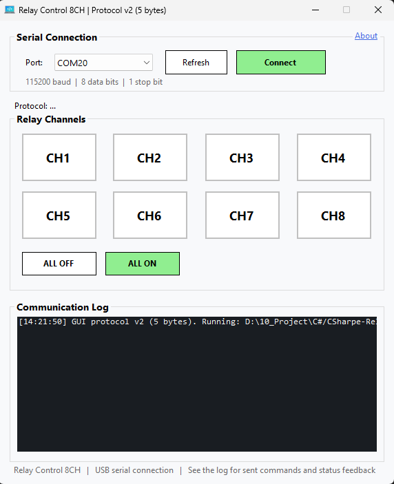

# CSharpe-RelayControl

<p align="left">
  
  
  
  
  
</p>

 

[🇹🇭 ภาษาไทย](#ภาษาไทย) | [🇬🇧 English](#english)

---

## 🇹🇭 ภาษาไทย

**CSharpe-RelayControl** เป็นโปรแกรมประยุกต์บน Windows (Windows Forms) ที่พัฒนาด้วย C# (.NET Framework 4.5) สำหรับควบคุมรีเลย์ 8 ช่อง (8-Channel Relay Module) ที่เชื่อมต่อกับไมโครคอนโทรลเลอร์ ESP32 ผ่านการสื่อสารทาง Serial Port (USB)

โปรแกรมนี้สามารถส่งคำสั่งเปิด-ปิดรีเลย์แต่ละช่องได้อย่างอิสระ และสามารถอ่านสถานะกลับ (Feedback status) จาก ESP32 เพื่ออัปเดตหน้าจอ GUI ให้ตรงกับสถานะจริงของรีเลย์ได้ทันที

### คุณสมบัติหลัก
*   **ควบคุมรีเลย์ 8 ช่อง:** สามารถเปิด/ปิด รีเลย์แต่ละช่องได้อย่างอิสระผ่าน CheckBox บน GUI
*   **การเชื่อมต่อ Serial Port:** เชื่อมต่อผ่าน USB Serial (Baudrate: 115200)
*   **การตรวจสอบสถานะ (Status Feedback):** เมื่อเปิดโปรแกรมหรือมีการเปลี่ยนแปลงสถานะ โปรแกรมจะอัปเดตสถานะให้ตรงกับ ESP32 ทันที (พร้อมบันทึกสถานะล่าสุดลง Flash memory ของ ESP32 ทำให้สถานะไม่หายเมื่อไฟดับ)
*   **โปรโตคอลสื่อสารที่ปลอดภัย:** ใช้โครงสร้างข้อมูลแบบ Frame `[STX] [DATA] [CHECKSUM] [ETX]` เพื่อป้องกันข้อมูลผิดพลาด

### การใช้งาน
1. อัปโหลดโค้ด Arduino ลงในบอร์ด ESP32 (ดูโค้ดด้านล่าง)
2. ต่อสายรีเลย์เข้ากับขา GPIO ของ ESP32 ตามที่กำหนดในโค้ด
3. เปิดโปรแกรม `RelayControlApp`
4. เลือกพอร์ต COM ที่เชื่อมต่อกับ ESP32
5. กดปุ่ม **Connect**
6. สามารถคลิกที่ CheckBox ของแต่ละ Relay เพื่อสั่งเปิด/ปิดได้ทันที

---

## 🇬🇧 English

**CSharpe-RelayControl** is a Windows Forms application developed in C# (.NET Framework 4.5) for controlling an 8-Channel Relay Module connected to an ESP32 microcontroller via Serial Port (USB).

This application can send independent ON/OFF commands to each relay channel and read back the status (feedback) from the ESP32 to instantly update the GUI to match the physical relay states.

### Key Features
*   **8-Channel Relay Control:** Independently control each relay via GUI CheckBoxes.
*   **Serial Communication:** Connects via USB Serial (Baudrate: 115200).
*   **Status Feedback:** Synchronizes the UI with the ESP32's current state upon connection and any state change (state is saved to ESP32 Flash memory so it persists across reboots).
*   **Secure Communication Protocol:** Uses a framed data structure `[STX] [DATA] [CHECKSUM] [ETX]` to prevent data corruption.

### How to Use
1. Upload the provided Arduino code to your ESP32 board.
2. Connect the relay module to the ESP32 GPIO pins as defined in the code.
3. Launch the `RelayControlApp`.
4. Select the COM port connected to the ESP32.
5. Click the **Connect** button.
6. Toggle the CheckBoxes to control each relay.

---

## 📡 Communication Protocol

**Baudrate:** 115200

*   **Command sent from PC to ESP32 (Control Relay):**
    `[0x02] [Status Byte] [Checksum Byte] [0x03]`
    *(Checksum is identical to the Status Byte)*
*   **Status Request sent from PC to ESP32:**
    `[0x05]`
*   **Feedback sent from ESP32 to PC:**
    `[0x02] [Status Byte] [Checksum Byte] [0x03]`

---

## 💻 Arduino Code (For ESP32)

คุณสามารถนำโค้ดด้านล่างนี้ไปอัปโหลดลงบน ESP32 ผ่าน Arduino IDE ได้เลย
You can upload the following code to your ESP32 using the Arduino IDE.

```cpp
#include <Preferences.h>

const int relayPins[] = {13, 12, 14, 27, 26, 25, 33, 32};
byte currentRelayState = 0x00; 
Preferences pref;

const byte STX = 0x02;
const byte ETX = 0x03;

void setup() {
  Serial.begin(115200);
  pref.begin("relay-app", false);
  currentRelayState = pref.getUChar("state", 0x00);

  for (int i = 0; i < 8; i++) {
    pinMode(relayPins[i], OUTPUT);
    bool bitValue = (currentRelayState >> i) & 0x01;
    digitalWrite(relayPins[i], bitValue ? LOW : HIGH); 
  }
}

void loop() {
  if (Serial.available() >= 4) {
    if (Serial.read() == STX) {
      byte data = Serial.read();
      byte checksum = Serial.read();
      byte stopByte = Serial.read();

      // ตรวจสอบ XOR Checksum (Data ^ Checksum ต้องได้ 0xFF)
      if (((data ^ checksum) == 0xFF) && (stopByte == ETX)) {
        if (data == 0x05) {
          // กรณีได้รับเฟรมขอสถานะ 02 05 FA 03
          sendFeedback(currentRelayState);
        } else {
          // กรณีได้รับเฟรมควบคุม Relay ปกติ
          updateRelays(data);
          sendFeedback(data);
        }
      }
    }
  }
}

void updateRelays(byte state) {
  currentRelayState = state;
  pref.putUChar("state", state);
  for (int i = 0; i < 8; i++) {
    bool bitValue = (state >> i) & 0x01;
    digitalWrite(relayPins[i], bitValue ? LOW : HIGH);
  }
}

void sendFeedback(byte state) {
  byte chk = 0xFF ^ state; // คำนวณ XOR Checksum
  byte frame[] = {STX, state, chk, ETX};
  Serial.write(frame, 4);
}
```

---
**Developer:** TOPTUBBY (Patiphan Phakdeeburi) | **Version:** 1.1.5.26
